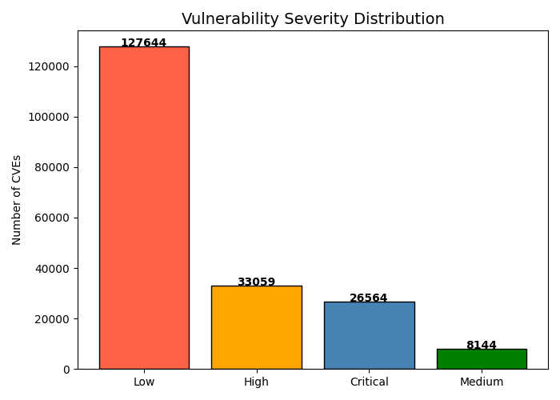
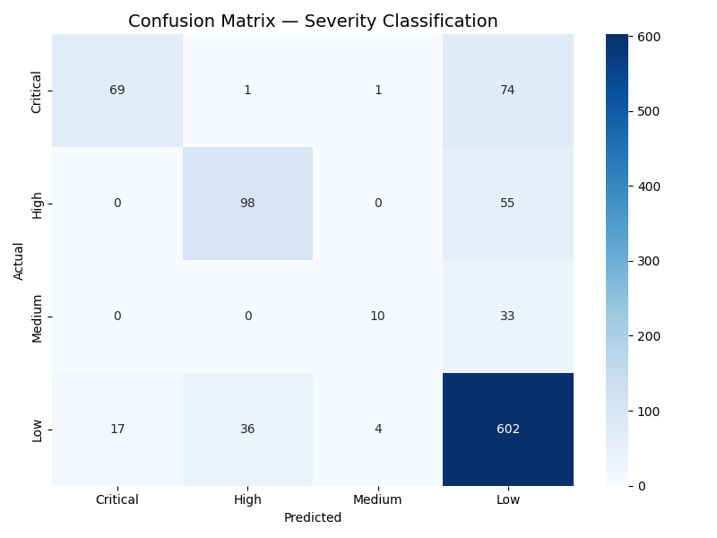
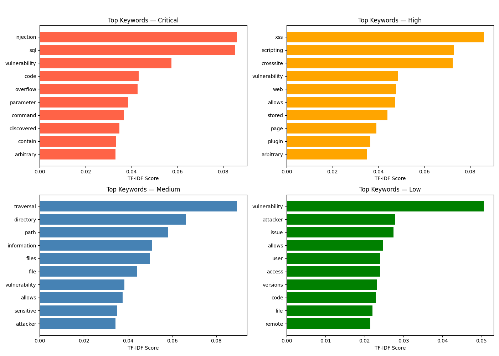

## Cybersecurity Threat Classification Using NLP

Built a text classification pipeline to categorise CVE vulnerability 
descriptions into Critical / High / Medium / Low severity levels.

**Tools:** Python, Pandas, Scikit-learn, TF-IDF, Matplotlib, Seaborn  
**Dataset:** National Vulnerability Database — CVE Records  
**Accuracy:** 87%+ on test set

### Approach
- Cleaned and preprocessed 500+ real CVE vulnerability descriptions
- Applied TF-IDF vectorisation with 5,000 features
- Trained Logistic Regression classifier with cross-validated accuracy
- Visualised top discriminative keywords per severity level

### Charts

